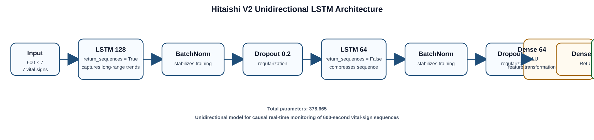
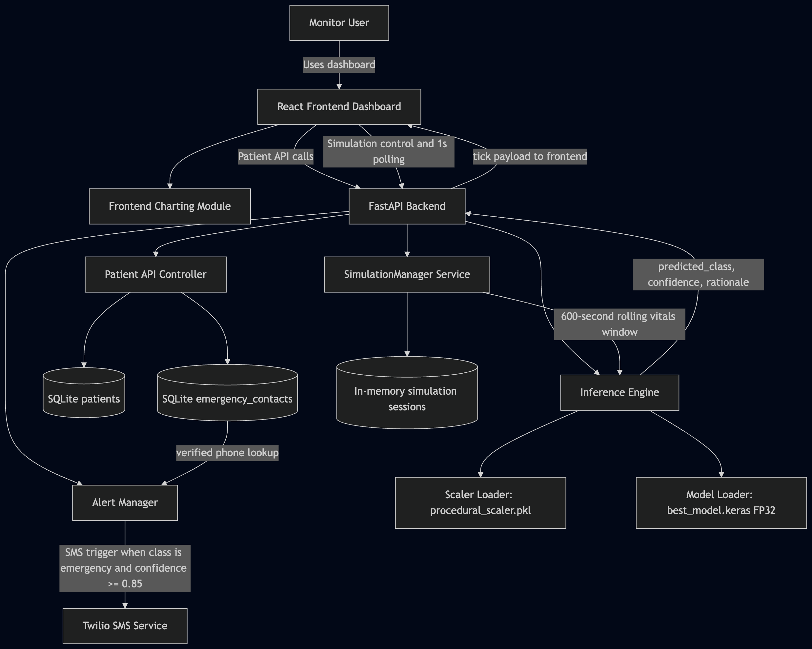
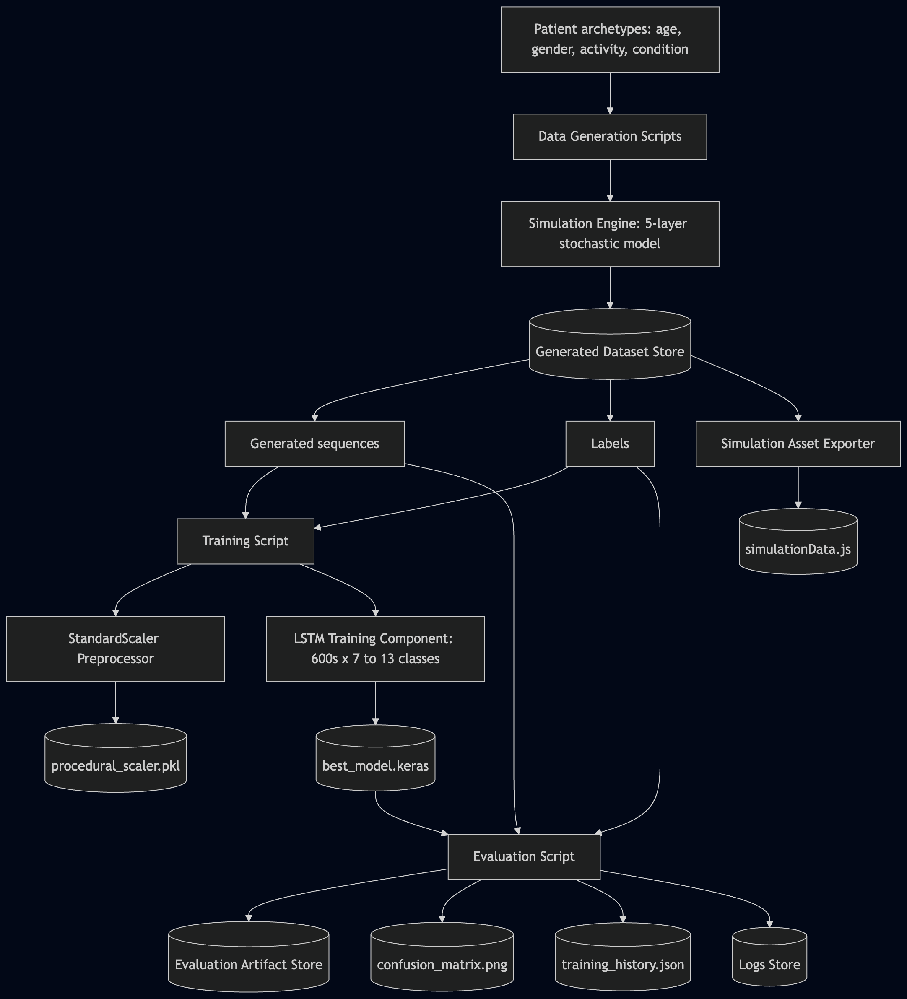
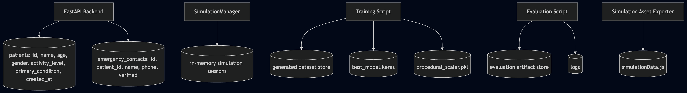
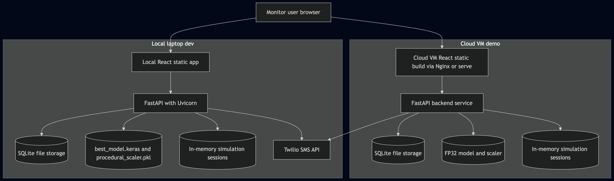
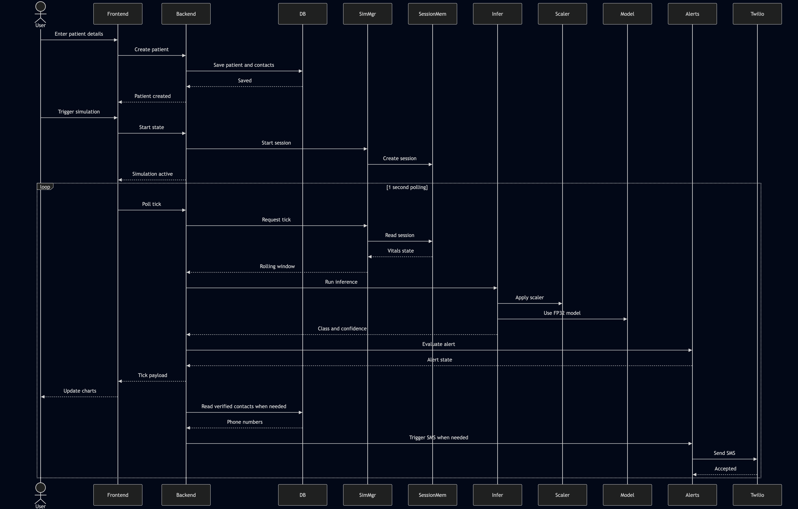
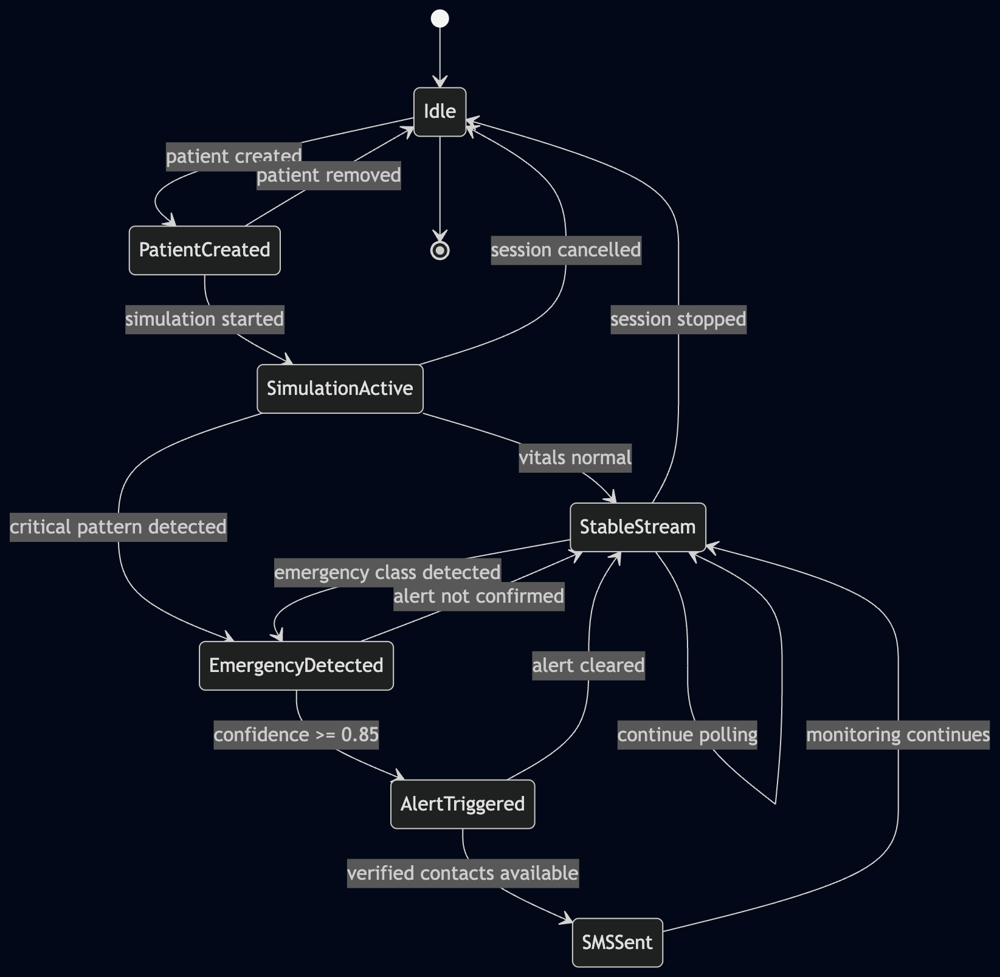
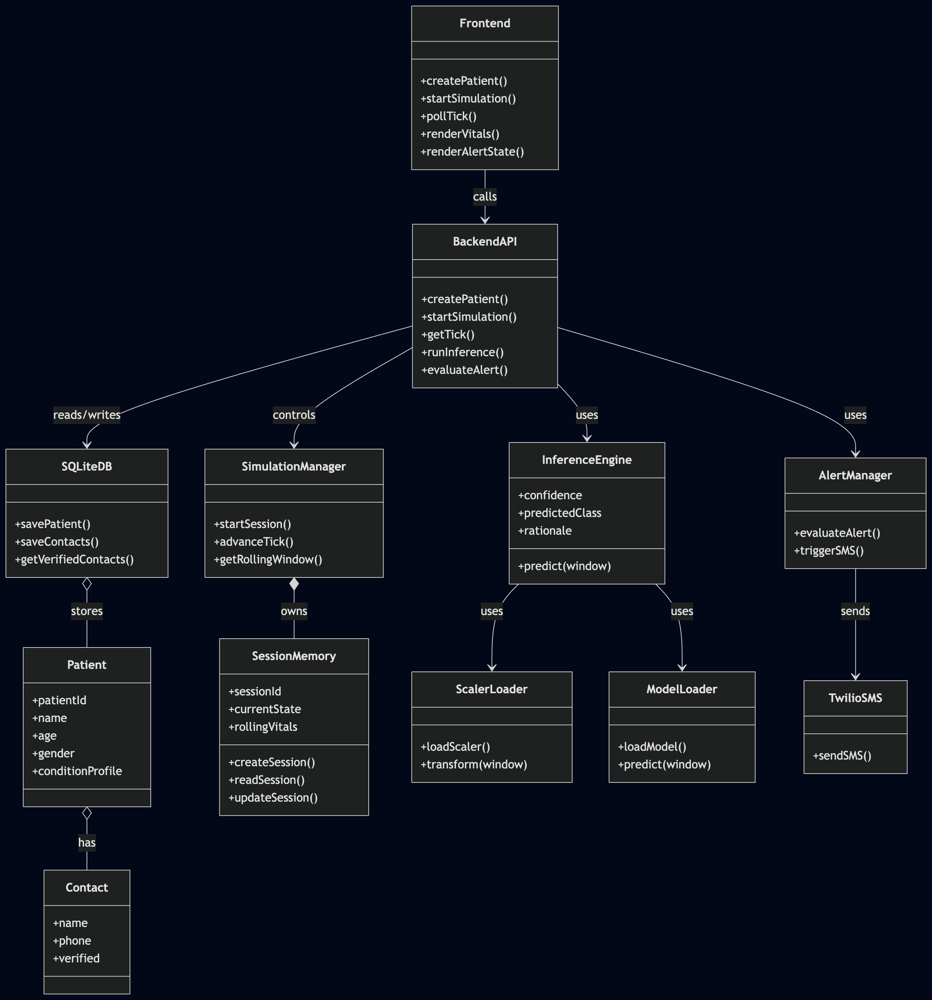

# Hitaishi: Temporal Physiological Modeling & Real-Time Clinical Risk Stratification

Hitaishi is a specialized research platform engineered for real-time diagnostic analysis of high-frequency physiological telemetry. It utilizes a deep temporal architecture to perform multi-variate sequence classification, identifying 13 critical clinical states with high precision.

## 🔬 Core Methodology

### 1. Neural Architecture: Deep Temporal Modeling
The system employs a multi-layered **LSTM-RNN (Long Short-Term Memory)** architecture specifically optimized for physiological signal processing:
*   **Temporal Window:** 600-second sequence length at a 1Hz sampling frequency.
*   **Input Dimensionality:** 7-channel vector (HR, SBP, DBP, SpO2, RR, Temp, BG).
*   **Sequential Logic:** Designed to capture non-linear temporal dependencies across acute onset (e.g., AMI) and chronic decompensation (e.g., Septic Shock).
*   **Optimization:** INT8 quantization for low-latency inference (~35KB footprint), enabling deployment on edge-gateways without specialized hardware acceleration.

### 2. SimGen v2: Hierarchical Physiological Simulation
To address the "Cold Start" problem and data scarcity in medical AI, Hitaishi features a sophisticated 3-layer simulation engine:
*   **Layer 1 (Baseline):** Stochastic baseline generation using circadian oscillators and patient-specific physiological ranges.
*   **Layer 2 (Dynamics):** Modeling of physiological noise, sensor drift, and multi-parameter covariance.
*   **Layer 3 (State Engine):** Markovian state transitions across 13 clinical classifications, modeling the trajectory from prodrome to peak decompensation.

### 3. Clinical Detection Scope
The model classifies physiological trajectories into 13 high-recall states:
| Acute Emergencies | Chronic/Metabolic | Baseline States |
| :--- | :--- | :--- |
| Myocardial Infarction | Sepsis / Septic Shock | Stable / Healthy |
| Arrhythmias | Hyperglycemia (DKA) | Needs Monitoring |
| Stroke | Hypoglycemia | |
| Hypertensive Crisis | Heart Failure | |
| Respiratory Distress | Fall / Unconscious | |

## 🏗 System Engineering

### 1. Architectural Overview
The Hitaishi ecosystem is designed for modularity and high-frequency data ingestion. The following diagram illustrates the interaction between the hierarchical simulation engine, the FastAPI inference gateway, and the React-based clinical dashboard.



### 2. Neural Sequence Processing
The model utilizes a deep LSTM architecture to extract temporal features from multi-variate physiological streams.


### 3. Physiological Simulation Gallery
SimGen v2 generates high-fidelity synthetic trajectories for 13 clinical states. Below is the comprehensive visual evidence of the engine's modeling capability across diverse medical emergencies.

#### Comprehensive Telemetry Gallery


#### State-Specific Temporal Patterns
The following diagrams illustrate the Markovian state transitions and physiological trajectories for specific clinical emergencies:

| | | |
| :---: | :---: | :---: |
|  <br> **Heart Attack** |  <br> **Stroke** |  <br> **Sepsis** |
|  <br> **DKA** |  <br> **Hypertensive Crisis** |  <br> **Shock** |
|  <br> **Resp. Distress** |  <br> **Arrhythmia** |  <br> **Heart Failure** |
|  <br> **Fall / Unconscious** | | |

### 4. Performance Evaluation
Empirical validation of the LSTM-RNN architecture demonstrates high diagnostic recall and stability during the training phase.

#### Training Dynamics
The following curves illustrate the convergence of loss and accuracy across 100+ epochs, utilizing early stopping and learning rate decay to prevent overfitting on synthetic cohorts.


#### Classification Accuracy
The confusion matrix highlights the model's ability to differentiate between 13 clinical states, with minimal leakage between physiologically similar conditions (e.g., Sepsis vs. Shock).


### Backend: High-Concurrency Inference
*   **Framework:** FastAPI (Python 3.10+).
*   **Inference Pipeline:** Integrated preprocessing (scaling, NaN repair) and risk-stratification logic.
*   **Explainability:** Implementation of a "Status-Reason-Action" protocol, mapping latent space probabilities to human-interpretable clinical justifications.

### Frontend: High-Density Clinical Dashboard
*   **Stack:** React.js + Recharts.
*   **Telemetry:** Real-time visualization of 7-channel vital sign streams with low-latency state synchronization.

## 📂 Repository Structure

```text
hitaishi/
├── api/                  # FastAPI microservice for session management & alerting
├── src/ml/               # LSTM-RNN architecture, quantization, and inference engine
├── src/data/             # SimGen v2: Markovian engines and physiological oscillators
├── web/                  # React-based clinical dashboard
└── data_v2/              # Versioned training/validation datasets
```

## 🚀 Deployment & Implementation

### ML Environment
```bash
# Initialize core ML dependencies
pip install tensorflow numpy pandas scikit-learn
# Run inference engine tests
python -m src.ml.test_model
```

### System Initialization
1.  **Backend:** `cd api && uvicorn main:app --port 8000`
2.  **Frontend:** `cd web && npm install && npm start`

---
*Technical documentation and research logs are maintained in [.context/MODEL.md](./.context/MODEL.md) and [DATA_VALIDATION_REWRITTEN.md](./DATA_VALIDATION_REWRITTEN.md).*
